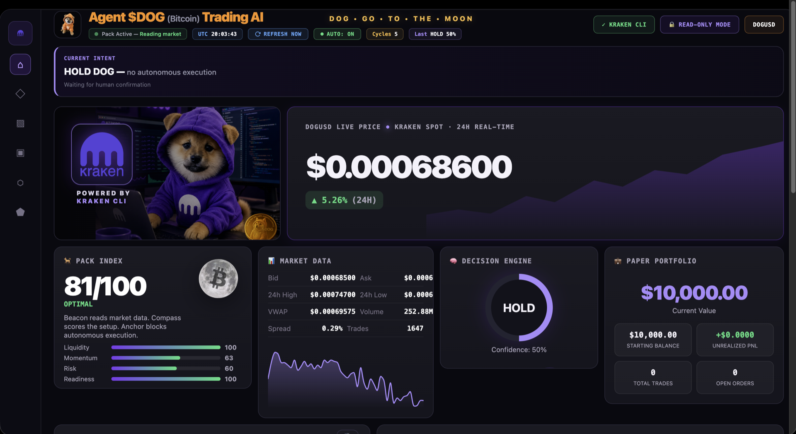
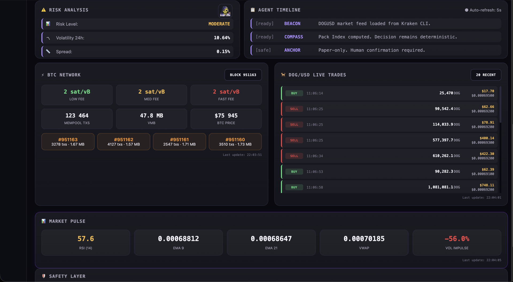
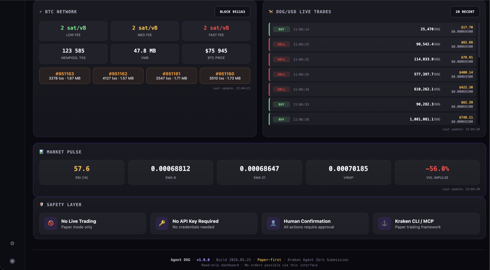

<div align="center">

# 🐕 Agent DOG

### **The DOG Army's safer trading companion.**

*Built for the DOG Army that wants to keep their sats safe.*

*Four Kraken CLI skills. Paper first. Human in control. Multi-agent ready.*

[](LICENSE)
[](docs/SAFETY.md)
[](https://github.com/krakenfx/kraken-cli)
[](docs/MCP_AGENT_COMPATIBILITY.md)
[](https://pro.kraken.com/app/trade/dog-usd)

**Five in the pack. One human in control. Zero risk. Woof to the moon. 🌙**

</div>

---

## 🎯 What is Agent DOG?

**Agent DOG** is a pack of **4 reusable Kraken CLI agent skills** — plus **🦉 Sage**, an in-dashboard AI educator — that turn your AI agent into a safe paper-trading companion for **$DOG** (DOG•GO•TO•THE•MOON on Bitcoin Runes — *not* Dogecoin).

It runs on top of the official [Kraken CLI](https://github.com/krakenfx/kraken-cli) and works with any AI agent that supports MCP or skills: **Claude Code, Cursor, Codex, OpenClaw, Gemini CLI, Goose, or plain terminal**.

### The problem

Most "AI trading bots" share three flaws:

1. They let the LLM make trading decisions (slow, expensive, non-deterministic)
2. They execute orders autonomously (no human in the loop)
3. They burn capital before the user understands what's happening

### The Agent DOG approach

```
Kraken CLI / MCP
       ↓
🐕 Beacon       reads DOGUSD market state
       ↓
🐕 Compass     deterministic Pack Index + decision
       ↓
🐕 Anchor    requires --confirm from human
       ↓
🐕 Helm    logs everything to events/decisions.jsonl
       ↓
🦉 Sage    explains every step in plain language — never decides
       ↓
   Human confirms → paper preview → paper-only execution
```

**No LLM decides. No bot executes. No surprises.** The AI explains. The Compass decides. The Anchor confirms. The Pack belongs to you.

> Beacon scans. Compass scores. Anchor holds. Helm prepares. Sage explains. The human steers.

---

## 🦉 Meet Sage — the AI Education Layer

The four Kraken CLI skills do the work. **Sage** makes it understandable.

Sage is an in-dashboard educational assistant that explains — in plain language — what the Pack Index means, why the Decision Engine says HOLD, what RSI / EMA / VWAP are, and what $DOG actually is. Sage reads the **live dashboard state** to answer in context.

**Sage explains. Sage never decides.** No trade recommendations, ever. The deterministic Compass stays in charge; the human stays in control.

---

## 📸 Visual Preview

Live dashboard captured on May 26, 2026.

### Dashboard Overview

The cockpit displays live DOGUSD market data, the deterministic Pack Index, the Decision Engine output, and the read-only paper portfolio.



### Market Intelligence

Risk analysis, agent timeline, Bitcoin network context, and the live DOG/USD trade tape — all read-only.



### Market Pulse & Safety

Real-time technical indicators (RSI, EMA, VWAP, Volume Impulse) and the safety layer enforced by hard-coded rules.



---

## 🚫 Why not "fully autonomous"?

Some AI trading bots make the LLM both the decision-maker AND the executor. Agent DOG made a different choice. Here's why.

### Real orders are irreversible

The Kraken CLI can execute real trades. Real orders cost real money and cannot be undone. Kraken itself recommends starting with paper trading, treating API keys carefully, and using safety nets like dead-man's switches and least-privilege scopes.

An LLM that decides AND executes trades is fast — but it's also non-deterministic, opaque to the user, and one prompt-injection away from a real loss. The DOG Army deserves better than that.

### What Agent DOG does instead

| Capability | Typical autonomous bot pattern | Agent DOG |
|------------|-----------------|-----------|
| LLM in decision loop | ✅ | ❌ Deterministic Compass |
| Auto-execute orders | ✅ | ❌ Human `--confirm` required |
| Single agent client | usually Claude only | 6+ clients (Claude / Cursor / Codex / OpenClaw / Gemini / Goose) |
| Profit promise | "grandmaster", "compounding returns" | none — education first |
| Default mode | live trading | paper trading, hard-coded |
| Position size | configurable | 5% max, enforced in code |
| Pair restrictions | usually none | DOGUSD only, hard-coded |
| Safety primitive | kill switch (reactive) | confirmation required (proactive) |
| Reusable agent skills | ❌ monolithic app | ✅ 4 Kraken-format skills |

### Safety is the product, not an afterthought

Agent DOG is built as a **progressive safety ladder**:

```
read-only dashboard   ← anyone can run this safely
       ↓
paper preview         ← Kraken CLI paper mode, no key needed
       ↓
paper execute         ← requires explicit human --confirm
       ↓
live trading          ← (future, opt-in only, user's own keys, never default)
```

Autonomy can be added later if the user wants it, with their own keys, on their own terms. **Safety is the product, not a footnote.**

> *Safety is the product. Built for the DOG Army.*

---

## 🧭 Design Philosophy

We don't optimize for profit. We optimize for **not losing your sats**.

- **Deterministic over magic** — the Compass score is plain math you can audit, not an LLM's guess.
- **One human in control** — every action waits for your `--confirm`. The pack prepares; you decide.
- **Refuse first** — Agent DOG actively says NO to weak setups (see the Decision Log). Most bots only know how to say yes.
- **Paper before real** — practice with virtual sats until you trust the pack. Live trading is off at the code level.
- **Show the work** — Pack Index breakdown, decision factors, agent consensus: nothing is hidden.

> They built a bot that trades for you. We built a pack that answers to you.

---

## ⚡ Quick Demo

### 30 seconds with Claude Code

```bash
# Install Kraken CLI (one-time)
brew install krakenfx/tap/kraken-cli

# Clone Agent DOG
git clone https://github.com/<your-username>/agent-dog.git ~/agent-dog
cd ~/agent-dog && npm install

# Link skills to Claude Code
for skill in skills/*/; do
  ln -sf "$(pwd)/$skill" ~/.claude/skills/
done

# Talk to the pack in Claude Code
# "Hey beacon, what is DOGUSD doing right now?"
```

### Or run it directly

```bash
npm run dashboard          # opens http://127.0.0.1:3100 — read-only cockpit
npm run agent:beacon        # the beacon reads DOGUSD market
npm run agent:compass      # the compass computes Pack Index + decision
npm run agent:demo         # full pack workflow (no orders executed)
```

---

## 🐕 Meet the Pack

Each skill is small, single-purpose, and follows the official Kraken CLI agent skill format.

### 🐕 The Beacon — `beacon-skill`

Reads DOGUSD market state via Kraken CLI. First into the field, reports what it sees.

```bash
kraken ticker DOGUSD -o json
kraken orderbook DOGUSD --count 10 -o json
kraken ohlc DOGUSD --interval 60 -o json
```

Returns: `bid`, `ask`, `last`, `high24`, `low24`, `vwap`, `volume24`, `spread`, `trades24`.

### 🐕 The Compass — `compass-skill`

Deterministic decision engine. **No LLM in this loop.** Reads the beacon's report, computes the proprietary **Pack Index** (0–100), outputs one of four decisions:

| Decision | Meaning |
|----------|---------|
| `WATCH_BUY` | Pack Index ≥ 70, conditions favorable, human review recommended |
| `HOLD`      | Pack Index 40–69, no strong signal either way |
| `NO_TRADE`  | Spread too wide / volume too low / range edges hit |
| `RISK_OFF`  | Volatility spike or guardrail triggered, stay out |

### 🐕 The Anchor — `anchor-skill`

The pack's safety officer. **Refuses to execute anything without explicit human `--confirm`**. Enforces all safety rules:

- Paper-only (no `LIVE_TRADING` flag accepted)
- Max 5% of paper balance per trade
- DOGUSD only (rejects XDGUSD, BTC, ETH, anything else)
- Confirmations expire after 60 seconds
- No API key required for previews

### 🐕 The Helm — `pack-recipe`

End-to-end coordinator that wires Beacon → Compass → Anchor → Helm. Logs every cycle to `events/decisions.jsonl` and builds a pack memory.

---

## 🚀 Installation

### Prerequisites

```bash
# Node.js 20+
node -v

# Kraken CLI (the foundation)
brew install krakenfx/tap/kraken-cli
kraken --version
```

### Option A — Skills mode (recommended for AI agents)

```bash
git clone https://github.com/<your-username>/agent-dog.git ~/agent-dog
cd ~/agent-dog
npm install
cp .env.example .env

# Link skills to your agent
# Claude Code:
for skill in skills/*/; do ln -sf "$(pwd)/$skill" ~/.claude/skills/; done

# OpenClaw:
for skill in skills/*/; do ln -sf "$(pwd)/$skill" ~/.openclaw/skills/; done
```

Then talk to your agent naturally:

```
You: "Hey beacon, what's DOGUSD doing?"
You: "Compass, compute the Pack Index"
You: "Anchor, preview a 100 DOG paper buy"
You: "Run the full pack and explain the decision"
```

### Option B — MCP mode (Claude Desktop, Cursor, Codex)

Add to your MCP config:

```json
{
  "mcpServers": {
    "kraken": {
      "command": "kraken",
      "args": ["mcp", "-s", "market,paper"]
    }
  }
}
```

Note: we only expose `market` and `paper` services. Live trading is **not** enabled by default.

### Option C — Standalone dashboard

```bash
npm run dashboard
open http://127.0.0.1:3100
```

A read-only cockpit showing DOGUSD live price, Pack Index, decision engine, paper portfolio, and an activity timeline. **No order can be sent from the dashboard.**

### Option D — Direct CLI

```bash
npm run agent:beacon        # ticker + orderbook + OHLC
npm run agent:compass      # decision engine
npm run agent:anchor     # paper preview (requires --confirm to execute)
npm run agent:demo         # full pack workflow
```

---

## 🛡️ Safety Contract

These rules are **hard-coded** and verified at runtime:

| Rule | Enforcement | Where |
|------|------------|-------|
| Live trading disabled | `LIVE_TRADING=false` constant | `src/config.js` |
| No API key required | Kraken CLI public data only | n/a |
| DOGUSD only | hard-coded pair, XDGUSD rejected | `src/strategy.js` |
| Max 5% per trade | enforced in Anchor | `src/risk.js` |
| Human confirmation | `--confirm` flag required | `scripts/dog_paper_execute.sh` |
| Confirmation timeout | 60 seconds | `src/risk.js` |
| Dashboard read-only | no POST/PUT/DELETE endpoints | `src/server.js` |
| MCP services | only `market,paper` | docs/MCP_AGENT_COMPATIBILITY.md |

See [docs/SAFETY.md](docs/SAFETY.md) for full safety documentation.

---

## 🔑 Keys & Credentials

Agent DOG itself requires zero credentials.

| You want to... | API key needed? |
|----------------|----------------|
| Run the dashboard | ❌ No |
| Run npm run agent:demo | ❌ No |
| Preview a paper trade | ❌ No — Kraken public data + local computation |
| Use Agent DOG inside Claude Code / Cursor / Codex / OpenClaw | ⚠️ Only the keys you already have for those agents |
| Future: optional LLM Explain Mode | ⚠️ Your own Claude/OpenAI key (opt-in only) |
| Future: optional live trading | ⚠️ Your own Kraken account key (opt-in only) |

The package itself never asks for, stores, or transmits credentials.
Kraken CLI public endpoints (ticker, orderbook, OHLC, trades)
require no authentication. The paper trading sandbox is local.

If you bring Agent DOG into Claude Code or another agent, your
agent's existing API key handles the LLM side. Agent DOG stays
out of that loop.

This matches Kraken's own guidance: **paper-trade first, go live
when you're ready** — and only with your own credentials.

---

## 🤖 Multi-Agent Compatibility

Agent DOG is **not Claude-only**. It works with any agent that can call Kraken CLI or speak MCP.

| Agent client | How to use Agent DOG |
|-------------|----------------------|
| 🦙 Claude Code | Symlink `skills/` into `~/.claude/skills/` |
| 🦙 Claude Desktop | MCP config (see Option B above) |
| 🖱️ Cursor | MCP config |
| 💻 Codex | MCP config |
| 🐧 OpenClaw | Symlink `skills/` into `~/.openclaw/skills/` |
| 🌐 Gemini CLI | MCP config |
| 🦢 Goose | MCP config |
| 🖥️ Terminal | `npm run agent:*` scripts directly |

The same 4 skills work everywhere. Bring your own agent.

See [docs/MCP_AGENT_COMPATIBILITY.md](docs/MCP_AGENT_COMPATIBILITY.md) for full setup details.

---

## 📊 The Pack Index — Proprietary Score

The **Pack Index** is Agent DOG's signature: a deterministic 0–100 score computed from market data by the Compass.

### Formula

```
Pack Index = (Liquidity × 0.25)
           + (Momentum × 0.25)
           + (Risk-inverted × 0.25)
           + (Readiness × 0.25)
```

### Sub-scores

| Component | What it measures | Sources |
|-----------|------------------|---------|
| **Liquidity** | spread, volume, orderbook depth | beacon-skill |
| **Momentum** | VWAP distance, range position, trend | beacon-skill + compass-skill |
| **Risk** (inverted) | volatility, range edges, spread anomalies | compass-skill |
| **Readiness** | paper balance, prior signals, helm memory | anchor-skill |

### Reading the score

| Range | Color | Meaning |
|-------|-------|---------|
| 80–100 | 🟢 Green | Optimal conditions, watch for entry |
| 60–79  | 🟡 Yellow-green | Favorable, conditions building |
| 40–59  | 🟡 Yellow | Neutral, no strong signal |
| 20–39  | 🟠 Orange | Caution, conditions deteriorating |
| 0–19   | 🔴 Red | High risk, stay out |

See [docs/PRODUCT_BRAIN_SPEC.md](docs/PRODUCT_BRAIN_SPEC.md) for full specification.

---

## ⚓ Why Kraken CLI?

Most agent projects die in the API docs. [Kraken CLI](https://github.com/krakenfx/kraken-cli) skips all of that:

- ✅ **JSON-first**: every command supports `-o json`
- ✅ **Stable errors**: structured error catalog with codes
- ✅ **Paper trading**: built-in sandbox, no API key required
- ✅ **MCP server**: local-first, services-scoped
- ✅ **134 commands**: full spot, futures, websocket coverage
- ✅ **50 official skills**: ready-to-use agent workflows

Agent DOG follows Kraken CLI's agent-first conventions:

```bash
kraken ticker DOGUSD -o json 2>/dev/null   # JSON to stdout, errors to stderr
```

We don't reinvent — we extend. Agent DOG adds:
- A proprietary Pack Index
- Storytelling pack roles (Beacon/Compass/Anchor/Helm)
- A safety layer with human-in-the-loop
- A premium read-only cockpit

---

## 🐶 About $DOG

`$DOG` = **DOG•GO•TO•THE•MOON** on Bitcoin Runes. The first major memecoin on Bitcoin layer-1.

| Token | Pair on Kraken | What it is |
|-------|----------------|-----------|
| `$DOG`  | `DOGUSD`       | ✅ Bitcoin Runes (this project) |
| `DOGE`  | `XDGUSD`       | ❌ Dogecoin (not this project, hard-rejected) |

Agent DOG hard-codes **DOGUSD** throughout. Any attempt to trade `XDGUSD` is rejected by the Anchor.

$DOG (DOGUSD) on Kraken: [pro.kraken.com](https://pro.kraken.com/app/trade/dog-usd)

---

## 🎯 For Kraken Reviewers

This section addresses what the Kraken Agent Zero jury cares about most.

### How we use Kraken CLI

- **`beacon-skill`** wraps `kraken ticker`, `kraken orderbook`, `kraken ohlc`
- **`anchor-skill`** wraps `kraken paper status`, `kraken paper buy`, `kraken paper sell`
- **`pack-recipe`** orchestrates a full Kraken CLI session
- All scripts use `-o json` and respect Kraken's error catalog

### How we use Kraken MCP

```json
{ "mcpServers": { "kraken": { "command": "kraken", "args": ["mcp", "-s", "market,paper"] } } }
```

Only `market` and `paper` services exposed. No `--allow-dangerous`. No `account` or `trade` services in the default config.

### What makes Agent DOG different

| Feature | Typical pattern  | Agent DOG |
|---------|------------------|-----------|
| LLM in decision loop | Yes | **No — deterministic Compass** |
| Autonomous execution | Yes | **No — human `--confirm` required** |
| Pair restrictions | None | **DOGUSD only, hard-coded** |
| Position size cap | None | **5% of paper balance, enforced** |
| Multi-agent support | One client | **6+ clients (Claude/Cursor/Codex/OpenClaw/Gemini/Goose)** |
| Visual proof | Logs only | **Read-only dashboard cockpit** |
| Proprietary metric | None | **Pack Index 0–100** |

### Files to inspect

- `CONTEXT.md` — runtime context for agents
- `CLAUDE.md` — Claude-specific integration
- `llms.txt` — LLM discoverability standard
- `agents/tool-catalog.json` — machine-readable tool catalog
- `skills/INDEX.md` — skill index
- `docs/PRODUCT_BRAIN_SPEC.md` — Pack Index specification
- `docs/SAFETY.md` — safety contract details
- `docs/ASSET_LICENSES.md` — asset attribution

---

## 📡 Market Intelligence Modules

Agent DOG ships with read-only market intelligence panels in the dashboard. **All panels are read-only. No order can be sent from the dashboard.**

### BTC Network Context
- Recommended fees (low / medium / fast in sat/vB)
- Mempool size (transactions, vMB)
- BTC spot price
- 4 most recent blocks (height, tx count, size, time)
- Source: [mempool.space](https://mempool.space) public API

### DOG/USD Live Trade Tape
- Last 20 DOGUSD trades on Kraken
- Side (buy/sell), price, volume, timestamp
- Source: Kraken CLI `kraken trades DOGUSD`

### Market Pulse
- RSI(14)
- EMA(9) / EMA(21)
- VWAP
- Volume Impulse
- Source: Kraken CLI `kraken ohlc DOGUSD --interval 5`
- All metrics computed locally, deterministic, no LLM

These modules give the cockpit market depth — but **no indicator triggers a trade automatically**. The Compass still owns the decision. The Anchor still requires `--confirm`. Market intelligence informs, it never executes.

---

## 🗺️ Roadmap

Phase 1 (this submission):
- ✅ 4 reusable Kraken CLI skills
- ✅ Pack Index deterministic engine
- ✅ Read-only cockpit dashboard
- ✅ Multi-agent compatibility
- ✅ Paper-only safety contract

Phase 2 (post-submission):
- ⏳ Optional LLM Explain Mode (bring your own API key, explain-only)
- ⏳ Helm skill — full pack memory + decision replay
- ⏳ Multi-pair support (always opt-in, not default)
- ⏳ WebSocket streaming via Kraken CLI

Phase 3 (community):
- ⏳ Community-contributed skills
- ⏳ Localizations (FR, ES, JA)
- ⏳ Discord integration option

---

## 📜 License

[MIT License](LICENSE) — Copyright (c) 2026 DOG Agent Contributors.

The pack belongs to everyone.

### Disclaimers

- **Not financial advice.** Agent DOG is an educational paper-trading tool. Nothing in this project constitutes investment advice.
- **Not affiliated with Kraken.** Agent DOG is an independent submission to the Kraken Agent Zero promotion. We are not endorsed by, affiliated with, or sponsored by Kraken or Payward, Inc.
- **Not affiliated with any official $DOG entity.** Agent DOG is built for the $DOG Army community but is not an official $DOG product.
- **Asset attribution.** See [docs/ASSET_LICENSES.md](docs/ASSET_LICENSES.md) for full attribution of visual assets used in this project.

---

## 🙏 Credits

- **Kraken CLI team** — for building the AI-native CLI we extend
- **$DOG Army community** — for the inspiration and the energy
- **Anthropic, Cursor, OpenAI, Google, Block** — for making powerful AI agents possible

Built with ❤️ for the **DOG Army**.

**Five in the pack. One human in control. Zero risk. Woof to the moon. 🌙**
